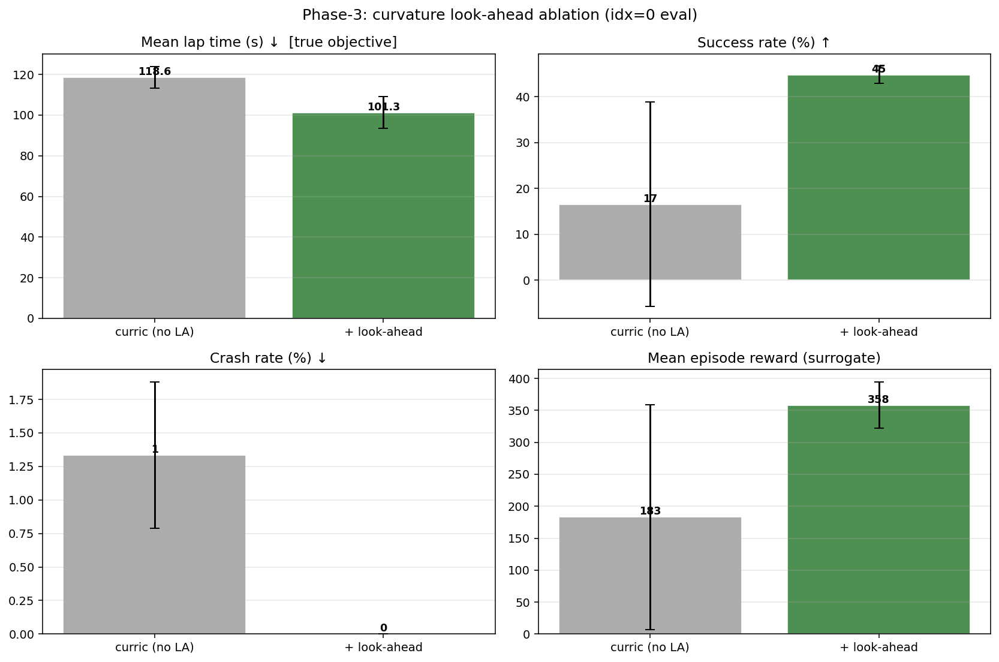
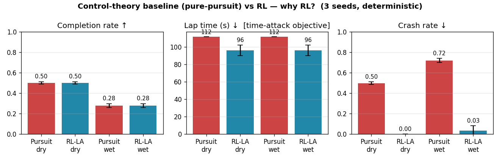

# F1 Driver — Model-free Deep RL (2D 연속 주행)

> 이전 프로젝트 [RL_f1](https://github.com/hiksh/RL_f1)(1차원·이산형 피트 월 전략가)에서 이어집니다.

실제 서킷 이미지에서 추출한 2차원 연속 트랙 위를, 조향·가감속·ERS·피트를 직접 제어하는
"차량 내부 드라이버" 정책을 Model-free Deep RL(DQN · PPO · SAC · TD3)로 학습합니다.
Project 01의 1차원·이산형 피트 월 전략가를, 차량을 직접 모는 2차원·연속형 드라이버로 전면 재설계했습니다.

| | Proj 01 (피트 월 전략가) | Proj 02 (인-카 드라이버) |
|---|---|---|
| 상태 | 6,840개 이산 상태 | 14차원 연속 벡터(차량·센서·환경) |
| 행동 | 6개 이산 행동 | 연속 `Box(4)` (조향·페달·ERS·피트) |
| 해법 | Value Iteration / Q-table | 함수 근사 Deep RL (DQN·PPO·SAC·TD3) |
| 트랙 | 19개 섹션 인덱스 | 실제 서킷 이미지에서 추출한 연속 2D 트랙 |


---

## 하이라이트

- 연속 제어(PPO·SAC·TD3)는 운전을 학습하지만, 행동을 이산화한 DQN은 거의 즉시(평균 767 m) 충돌(98.9%)하며 붕괴 — 이 문제에서 액션 이산화는 치명적.
- SAC은 가장 빠르고(랩타임 118.3 s) 가장 안전(크래시 18.5%), PPO는 가장 자주 완주(6.9%) — 두 방법이 상보적.
- 보상 설계가 학습 성패를 가른다: 잘못된 보상에선 코너 앞에서 멈추는 brake-and-park 국소최적에 갇히고, racing 보상만 이를 탈출(진행거리 7×↑).
- 곡률 look-ahead 관측이 헤드라인 결과: 완주율 17% → 45%, 크래시 0%, 시드 간 분산 ±27%p → ±2.3%p로 제거 — 어떤 시드로 돌려도 재현되는 정책.
- 왜 RL인가: 학습 없는 고전 제어(pure-pursuit)와 같은 축에서 비교 시 RL이 랩타임 ~14% 빠름(ERS 전략 활용) + 크래시 ~0%.

> 보상은 대리(surrogate) 지표일 뿐, 진짜 목표는 충돌 없이 제한시간 내 최단 완주입니다.
> 핵심 지표는 랩타임(성공 에피소드 한정)·성공률·크래시율이며, 프리셋마다 보상 스케일이 달라 보상끼리는 비교하지 않습니다.

---

## 1. 트랙 재구성 (`build_track.py`)

실제 서킷 이미지(`assets/track.webp`)에서 주행 가능한 2D 중앙선을 자동 추출합니다.

```
track.webp ──build_track.py──▶ assets/track.npz         (centerline / left / right / half_width)
                            └─▶ assets/track_preview.png (검증용 4-패널 이미지)
```

1. 검은 트랙 밴드 마스킹 → 가장 큰 연결요소만 추출(라벨·범례 제거)
2. 트랙은 고리(annulus) 형태 → 바깥/안쪽 윤곽(contour)의 중점을 중앙선으로 계산 *(skeleton 그래프-탐색은 무한루프로 폐기, contour 중점법이 강건)*
3. 윤곽 사이 거리로 트랙 폭 추정 → 백분위(p10–p80) 클램프 + 스무딩으로 코너 이상치 제거(폭 ≈ 47 m)
4. 픽셀 → 월드 좌표 변환, 한 랩 5,000 m로 스케일, 400 waypoint로 리샘플

env는 `track.npz`만 로드하므로, 이미지를 바꾸면 `python build_track.py`만 다시 돌리면 됩니다(코드 수정 불필요).


---

## 2. MDP 정식화

물리 스텝 `DT = 0.25 s`, 최고 속도 `MAX_SPEED = 90 m/s`. 타이어·날씨 동역학은 짧은 마이크로 레이스(3랩)에서도
체감되도록 10배 가속(`TIRE_SCALE = 10`)했습니다.

### 상태 — 14차원 연속 벡터

| # | 변수 | 정규화 | 설명 |
|---|------|--------|------|
| 1 | Speed | `v / MAX_SPEED` | 현재 속도 |
| 2–3 | Heading error | `sin`, `cos` | 진행 방향과 트랙 접선의 각도 차(±π 불연속 제거 위해 sin/cos 분리) |
| 4 | Lateral offset | `/ half_width` | 중앙선 기준 횡방향 이탈(부호 = 좌/우) |
| 5 | Compound | 0 / 1 | Dry(0) / Inter(1) 타이어 |
| 6 | Tire temp | 0–1 | Cold → Optimal(0.40–0.75) → Overheat(>0.85) |
| 7 | ERS | 0–1 | 배터리 잔량 |
| 8–12 | Raycast ×5 | 0–1 | 부채꼴(−70°,−35°,0°,35°,70°) 방향 벽까지 거리(`/120 m`, 멀면 1) |
| 13 | Wetness | 0–1 | 노면 젖음(연속) |
| 14 | Rain prob | 0–1 | 다음 랩 강우 관련 확률 |
| (+15–16) | Curvature look-ahead ×2 | −1–1 | *(옵션)* 30 m·70 m 앞 트랙이 꺾이는 각(`/π`, 부호=좌/우) |

자기 상태(속도·방향오차·횡이탈) + 환경 인식(raycast) + 전략 변수(타이어·온도·ERS·날씨)를 한 벡터에 담은 멀티모달 구성.

### 행동 — 혼합형을 단일 `Box(4)`로 인코딩

| # | 행동 | 범위 | 의미 |
|---|------|------|------|
| 0 | Steering | −1 … 1 | 좌 … 우 |
| 1 | Pedal | −1 … 1 | 풀 브레이크 … 풀 스로틀 |
| 2 | ERS_Deploy | −1 … 1 | (내부에서 0…1로 매핑) 배터리 방출량 |
| 3 | Pit_signal | −1 … 1 | `> 0.5`면 피트 요청 → 다음 start/finish 통과 시 타이어 교체 |

SB3의 연속제어 알고리즘(SAC/DDPG/TD3)은 `Box`만 받고 Dict/Tuple 혼합 액션을 지원하지 않습니다. 그래서
본질적으로 이산인 피트 결정을 연속 Box의 한 차원으로 임베딩(임계값 0.5)해 모든 알고리즘과 호환되게 했고,
모든 차원을 `[-1, 1]` 대칭으로 둬 SAC의 tanh 정책과 정합시켰습니다. (DQN은 이 Box를 21개 이산 액션으로 재매핑)

### 전이 — 2D 키네마틱 차량 모델

매 스텝 다음 순서로 상태를 갱신합니다 ($g$ = grip, 젖은 노면+Dry 타이어면 0.6, 아니면 1.0).

① 종방향 — 페달이 가/제동을, ERS가 추가 부스트를 만들고 드래그로 감속:

$$
a=\begin{cases}\text{pedal}\cdot a_\text{acc}+\text{ers}_\text{dep}\cdot b_\text{ers}\,\mathbb{1}[\text{ers}>0], & \text{pedal}\ge 0\\ \text{pedal}\cdot a_\text{brk}, & \text{pedal}<0\end{cases}
\qquad
v\leftarrow\mathrm{clip}\!\big(v+a\,g\,\Delta t-c_d\,v,\;0,\;v_\text{max}\big)
$$

② 조향/방향 (속도 비례 권한):

$$
\kappa=\min\!\big(1,\;v/v_\text{ref}\big),\qquad
\theta\leftarrow\theta+\text{steer}\cdot\dot\psi_\text{max}\cdot\kappa\cdot g\cdot\Delta t
$$

> 조향 권한 $\kappa$가 속도에 비례 → 속도가 0이면 핸들이 안 돌아갑니다. 이 한 줄이 뒤의 brake-and-park(코너 앞에서 멈추면 영영 못 빠져나옴) 현상의 물리적 원인입니다.

③ 위치 적분:

$$\mathbf{p}\leftarrow\mathbf{p}+v\,\Delta t\,(\cos\theta,\;\sin\theta)$$

④ ERS 배터리 — 스로틀 중 방출 시 소모, 브레이크 시 회생:

$$\text{ers}\leftarrow\text{ers}-\text{ers}_\text{dep}\,r_\text{use}\,\Delta t\,\mathbb{1}[\text{pedal}\ge0]+r_\text{regen}\,\Delta t\,\mathbb{1}[\text{pedal}<0]$$

⑤ 타이어 온도 — 하드 드라이빙(부하 $\ell$)으로 가열, 주변온도로 냉각:

$$\ell=|\text{pedal}|\,(v/v_\text{max})+0.5\,|\text{steer}|,\qquad
T\leftarrow T+\big(h\,\ell-c\,(T-T_\text{amb})\big)\,\Delta t\,s_\text{tire}$$

⑥ 노면 젖음 — 현재 날씨 목표값으로 드리프트:

$$w\leftarrow w+(w^{\ast}-w)\,r_w\,\Delta t\,s_\text{tire},\qquad w^{\ast}=\mathbb{1}[\text{raining}]$$

⑦ 날씨 전이 — 랩 완료 시 토글: $P(\text{Dry}\to\text{Rain})=0.30$, $P(\text{Rain}\to\text{Dry})=0.40$.
⑧ 피트 — 요청 시 다음 랩 진입에서 노면에 맞춰 타이어 교체(젖음>0.45 → Inter), 온도 리셋, 페널티.
⑨ 진행도 — 현재 위치를 중앙선 세그먼트에 투영해 미터 단위 연속 progress를 계산(dense 보상이 매끄럽도록).

### 보상

| 항목 | 값 | 설명 |
|------|----|------|
| Progress (dense) | `+0.05 × 전진거리(m)` | 중앙선 따라 전진(세그먼트 투영으로 연속) |
| Time penalty | `−0.03 / step` | 빠른 완주 유도 |
| Speed reward | `+speed_reward × (v/Vmax)` | (기본 0, 셰이핑용) |
| Overheat / Slip | `−0.5` / `−0.3` per step | 과열(>0.85) / 젖은 노면+Dry |
| Pit | `−30` | 피트 1회 |
| Crash | `−500` + 종료 | 횡이탈 > 트랙 폭 |
| Complete | `+200` + 종료 | 목표 랩 완주 |

종료: 충돌(`−500`) · 완주(`+200`) · 시간초과(`steps ≥ n_laps×500` = 3랩이면 1500 스텝 = 375 s, truncated).
(선택) terminal time-bonus는 완주가 빠를수록 추가 보너스를 줘 "제한시간 내 최단 완주"를 보상에 직접 인코딩합니다.

---

## 3. 알고리즘

| 역할 | 알고리즘 | 액션 공간 | 근거 |
|------|----------|-----------|-----------|
| value-based | DQN | Discrete(21) | 연속 Box를 이산화해야만 동작 → 이산화의 한계를 보여주는 대조군 |
| policy-based | PPO | Box(4) | on-policy actor-critic, 안정적 표준 기준선 |
| your solution | SAC | Box(4) | off-policy + 엔트로피 최대화 — 연속 제어·확률적 동역학에 최적 |
| 추가 비교군 | TD3 | Box(4) | off-policy 결정론적 정책 — SAC의 엔트로피 탐색 효과를 분리하는 대조 |

왜 SAC인가 — ① off-policy 리플레이로 짧은 마이크로 레이스에서도 샘플 효율↑, ② 엔트로피 최대화 탐색으로
젖음·타이어 같은 확률적 동역학과 좁은 코너에서 강건(결정론적 TD3가 빠지는 국소최적 회피), ③ 연속 제어를
native로 처리(이산화 손실 없음, tanh 정책이 `[-1,1]`과 정합).

주요 하이퍼파라미터 (공통: `γ=0.99`, MLP `[256,256]`, GPU 자동 감지)

| 알고리즘 | 설정 |
|----------|------|
| DQN | lr 1e-3, buffer 200k, batch 128, train_freq 4, target_update 2k, exploration_fraction 0.3 |
| PPO | n_steps 1024, batch 256, n_epochs 10, GAE λ 0.95, ent_coef 0, lr 3e-4, n_envs 병렬 |
| SAC | lr 3e-4, buffer 300k, batch 256, τ 0.005, train_freq 1, ent_coef auto |
| TD3 | SAC 골격 + action_noise N(0, 0.1), 결정론적 타깃 정책 |

> 연속 제어에선 ε-greedy(DQN)가 아니라 stochastic policy / entropy로 탐색합니다 — SAC는 `ent_coef=auto`가
> 탐색량을 자동 조절, PPO는 정책 확률성, TD3는 외부 action noise. 병목은 GPU가 아니라 Python 환경 스텝이라
> PPO는 `--n-envs` 병렬화로 가속됩니다(측정: PPO ~930 fps@6envs, SAC ~92 fps).

---

## 4. 결과

GPU 서버에서 메인 4개 알고리즘 × 5 시드(`racing` 프리셋) + SAC ablation을 학습했습니다
(DQN·SAC·TD3 각 500k, PPO 1M timestep). 모든 수치는 마지막 300 에피소드 평균(± 시드 표준편차).

### 4-1. 알고리즘 비교


| 방법 | 랩타임(s) ↓ | 성공률 ↑ | 크래시율 ↓ | 평균 진행거리(m) | 평균 보상(대리) |
|------|------------:|---------:|-----------:|-----------------:|----------------:|
| DQN  | — (완주 없음) | 0.0 % | 98.9 % |   767 |  −86 |
| PPO | 121.3 | 6.9 % | 30.8 % | 5099 | 142 |
| SAC | 118.3 | 2.8 % | 18.5 % | 4834 | 106 |
| TD3  | 120.5 | 1.2 % | 18.9 % | 2520 |  −86 |

- 이산화 value-based(DQN)의 붕괴: 21개 이산 액션으론 거의 즉시 충돌(98.9 %), 완주 0건.
- PPO vs SAC 트레이드오프: 자주 끝내는 PPO(6.9 %) vs 빠르고 안전한 SAC(118.3 s · 18.5 %).
- SAC은 ~350k에서 가장 빠르게 수렴, PPO는 1M까지 꾸준히 올라 동급, TD3는 끝내 양(+)으로 못 올라옴(결정론적 탐색 불안정), DQN은 평탄.

| SAC (your solution) | DQN (이산화 baseline) |
|---|---|
|  |  |


*결정론적 롤아웃 — SAC은 직선 가속→코너 감속으로 2랩 이상 주행, DQN은 출발 직후 충돌(빨간 X). 우측 패널은 속도·ERS·타이어온도·젖음·컴파운드·랩·조향·페달 텔레메트리.*

### 4-2. 보상 설계가 성패를 가른다 (SAC ablation)


| 프리셋 | 성공률 | 크래시율 | 진행거리(m) | 거동 |
|--------|-------:|---------:|------------:|------|
| baseline   | 0 % | 4.7 % |  648 | 코너 앞 정지(brake-and-park) |
| no_shaping | 0 % | 6.3 % |  747 | 동일하게 주차 |
| aggressive | 0 % | 8.3 % |  775 | 거의 주차 |
| racing | 2.8 % | 18.5 % | 4834 | 유일하게 실제 주행 |

충돌 페널티(−500)가 시간 페널티를 압도하면 약한 정책은 코너에서 완전 정지하는 안전한 국소최적에 갇히고,
속도 0이면 조향 권한도 0(§2 ②)이라 영영 못 빠져나옵니다. 속도 보상을 강하게 준 racing만 이를 탈출해
진행거리가 7× 이상 증가합니다(크래시율 상승은 정지 대신 실제로 코너에 진입하는 의도된 trade-off).

### 4-3. 센서: raycast & 곡률 look-ahead

raycast를 끄면(`--no-raycast`) 진행거리·보상은 오히려 커지지만 크래시율이 약 2배(14.0 % → 31.3 %)로 뜁니다 —
벽 거리 정보가 충돌 회피(안전성)에 기여함을 확인.

곡률 look-ahead가 코너 약점을 푸는 결정적 레버입니다. 30 m·70 m 앞 트랙이 꺾이는 각을 obs에 추가해
코너를 반응적으로가 아니라 예견해서 감속하게 만들면:



| 설정 | 랩타임(s) ↓ | 성공률 ↑ | 크래시율 ↓ | 성공 seed |
|------|------------:|---------:|-----------:|:---------:|
| 커리큘럼 (no LA) | 118.6 ± 7.4 | 16.6 ± 27.2 % | 1.3 ± 0.7 % | 2 / 3 |
| + look-ahead | 101.3 ± 9.7 | 44.8 ± 2.3 % | 0.0 ± 0.0 % | 3 / 3 |

성공률 17%→45%보다 중요한 건 분산을 죽였다는 점입니다: no-LA의 성공률 std는 ±27%p(이봉성)인데 +LA는
±2.3%p — 세 시드 모두 42~47%로 수렴하고 크래시 0%. RL에서 평균 향상보다 어려운 시드 간 분산 제거를
곡률 미리보기 하나가 해냈기에, 본 프로젝트의 헤드라인으로 보고합니다.

### 4-4. 진짜 목표 = 타임어택

시간제한이 binding(완주 랩타임이 제한선에 거의 붙음)이라, 빠르게와 완주가 같은 방향입니다. 페이스를
미는 보상(dense `speed_reward`↑/`time_pen`↑)과 완주 시 빠를수록 커지는 terminal bonus를 결합한 timeattack이 최적:

| 프리셋 | 랩타임(s) ↓ | 성공률 ↑ | 크래시율 ↓ | 비고 |
|--------|------------:|---------:|-----------:|------|
| racing (base) | 118.3 | 2.8 % | 18.5 % | Phase-1 기준 |
| timeattack_dense | 117.8 | 4.6 % | 13.3 % | dense만 — 가장 안전 |
| timeattack_finish | 120.1 | 1.7 % | 21.4 % | terminal만 — sparse해 무효 |
| timeattack | 114.1 | 5.4 % | 15.0 % | 둘 다 — 3지표 동시 개선(Pareto) |

timeattack은 racing 대비 랩타임 −4.2 s · 성공률 ≈2배 · 크래시율 −3.5 pp를 동시에 달성합니다. dense가 핵심
레버이고, terminal은 단독으론 sparse해 무효지만 dense로 완주 빈도를 올린 뒤 더하면 상보적으로 작동합니다.

### 4-5. 왜 RL인가 — pure-pursuit 대비

"알려진 트랙 타임어택이면 고전 제어로 충분하지 않나?"를 정면 검증하기 위해, 학습이 없는 기하 컨트롤러
(pure-pursuit + 요레이트 기반 코너속도 P-제어, ERS·피트·열관리는 의도적 배제)를 같은 축에서 비교했습니다.
양쪽 모두 결정론적, seed 0–2 × 300 ep.



| 방법 / 조건 | 랩타임(s) ↓ | 완주율 | 크래시율 ↓ | 과열율 ↓ |
|------------|---------:|----------:|----------:|--------:|
| Pure-pursuit · dry | 111.6 ± 0.0 | 0.50 ± 0.01 | 0.50 ± 0.01 | 0.53 ± 0.00 |
| RL look-ahead · dry | 96.1 ± 6.1 | 0.50 ± 0.01 | 0.00 ± 0.00 | 0.07 ± 0.03 |
| Pure-pursuit · wet | 111.6 ± 0.0 | 0.28 ± 0.02 | 0.72 ± 0.02 | 0.53 ± 0.00 |
| RL look-ahead · wet | 96.1 ± 6.1 | 0.28 ± 0.02 | 0.03 ± 0.05 | 0.23 ± 0.16 |

완주율은 정확히 동률입니다 — 둘 다 랩 경계의 확률적 강우라는 같은 외부 천장에 막히기 때문. 따라서 변별
지표는 랩타임이고, 여기서 RL이 96.1 s vs 111.6 s로 ~14 % 빠릅니다. pure-pursuit가 ERS(+10 m/s²)를 버리는 반면
RL은 거의 매 스텝 ERS를 배치(평균 deploy ≈ 0.6)해 코너 탈출이 빠릅니다. 즉 주행 코어는 제어이론으로 충분하지만,
ERS 같은 전략 레버를 활용한 시간 최적화는 RL이 보상으로부터 학습한 부분이고 그게 랩타임 차이로 나타납니다.
덤으로 RL은 같은 완주율을 크래시 ~0 % · 과열 0.07(vs 50–72 % · 0.53)로 더 안전하게 달성합니다.

---

## 5. 한계 & 향후 과제

- 시드 분산(bimodal): 랜덤-시작 커리큘럼·부드러움 λ sweep 단독으로는 세 시드 중 하나만 학습되고 나머지는
  붕괴하는 이봉성을 보였습니다. 곡률 look-ahead(§4-3)가 이 분산을 안정적으로 제거했으나, 그 외 레버의 시드
  강건성은 여전히 과제입니다.
- 완주율 천장(마른 트랙 ~50%): 남은 실패는 대부분 랩 경계의 확률적 강우(젖은 노면+Dry 타이어 슬립)로
  인한 시간초과입니다. 날씨 커리큘럼·피트 전략 학습이 다음 병목.
- warm-start fine-tune 붕괴: 수렴한 racing 정책에 저LR로 더 공격적인 보상을 얹으면 학습된 안전 거동이
  무너졌습니다 — 이 프로젝트에선 from-scratch sweep이 fine-tune보다 안정적이었습니다.
- TD3 불안정 / 날씨 강제 시 재붕괴: 결정론적 정책이 좁은 코너에서 나쁜 국소최적에 빠지고, `--random-weather`
  로 젖은 출발을 강제하면 timid collapse가 재발 → 현재는 랩 경계 자연발생 날씨만 사용.
- 단일 트랙 / 단순화된 물리: 한 서킷에만 학습(일반화 미검증), bicycle 키네마틱 근사(슬립앵글·하중이동 미반영).
  향후엔 절차적 생성 트랙으로 멀티-트랙 일반화.

---

## 6. 실행 & 파일 구조

```
pip install -r requirements.txt
python build_track.py                              # 트랙 추출 (이미지 수정 시에만)
python train.py --algo all --smoke                 # 파이프라인 점검 (CPU)

# 메인 학습 (GPU 권장)
python train.py --algo sac --reward-preset racing --timesteps 500000 --seed 0
python train.py --algo ppo --reward-preset racing --timesteps 1000000 --n-envs 6 --seed 0

# Ablation
python train.py --algo sac --reward-preset no_shaping --seed 0
python train.py --algo sac --reward-preset racing --no-raycast --seed 0

# 타임어택 + 곡률 look-ahead (학습은 랜덤 시작, 평가는 idx=0)
python train.py --algo sac --reward-preset timeattack --steer-pen 0.05 --random-start --lookahead --seed 0

python baseline.py                                 # pure-pursuit vs RL 비교
python visualize.py                                # results/ 자동 탐색 → 그림 생성
```

서버 일괄 실행: `bash run_all.sh`(메인+ablation) → `run_phase2.sh`(타임어택) → `run_phase3.sh`(커리큘럼·look-ahead).

| 파일 | 역할 |
|------|------|
| `build_track.py` | 트랙 이미지 → 2D 중앙선/경계 추출 (`assets/track.npz`) |
| `env.py` | `F1DriverEnv` — gymnasium 연속 환경 (상태·행동·전이·보상) |
| `wrappers.py` | `DiscretizedF1Driver` — DQN용 21개 이산 액션 |
| `train.py` | SB3 학습 파이프라인 (DQN/PPO/SAC/TD3, 프리셋·fine-tune·eval·ckpt·metrics·tb) |
| `baseline.py` | 비-RL 제어 baseline (pure-pursuit) + dry/wet eval·비교 figure |
| `visualize.py` | 트랙맵·레이싱라인·raycast GIF·학습곡선·알고리즘 비교·ablation |
| `run_*.sh` | 서버 일괄 실행 스크립트 (`run_all` / `run_phase2` / `run_phase3`) |
| `assets/` · `results/` | 트랙 데이터 / 학습 결과물 (일부만 커밋, 나머지 `.gitignore`) |

재현성: 메인 비교는 시드 0–4, ablation·Phase-2/3은 0–2. 에피소드별 지표를 CSV로 저장해 모든 figure를
`python visualize.py`로 재생성합니다. 환경 버전은 `requirements.txt` 참고
(gymnasium 1.2.3, stable-baselines3 2.8.0, torch 2.12.0).
