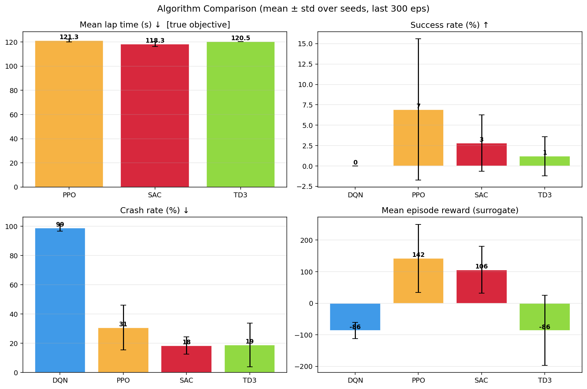
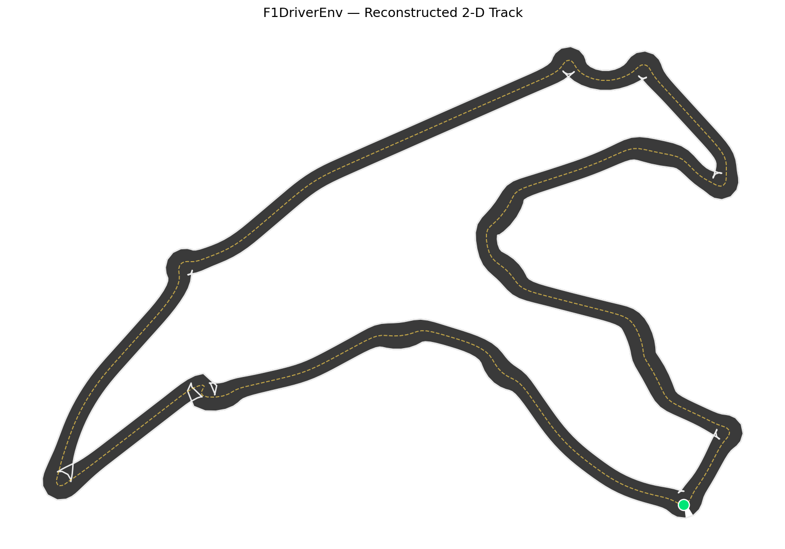
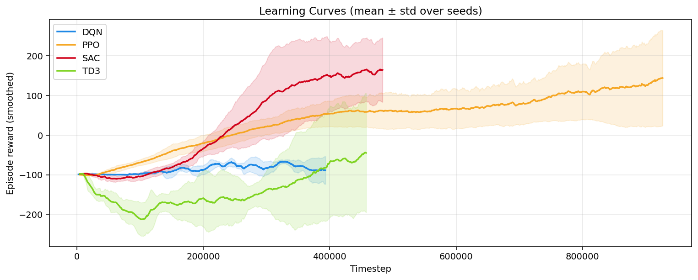
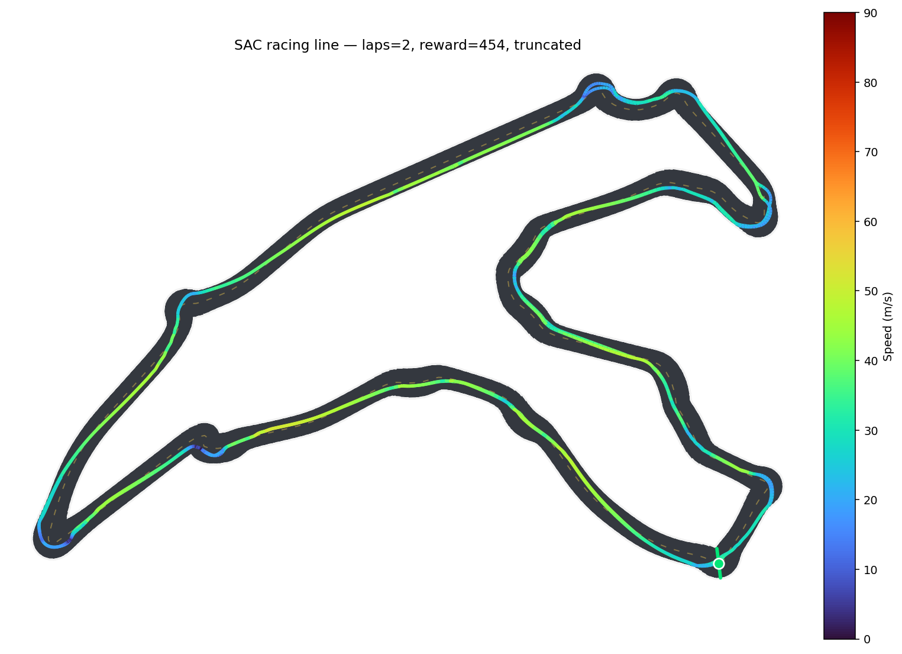
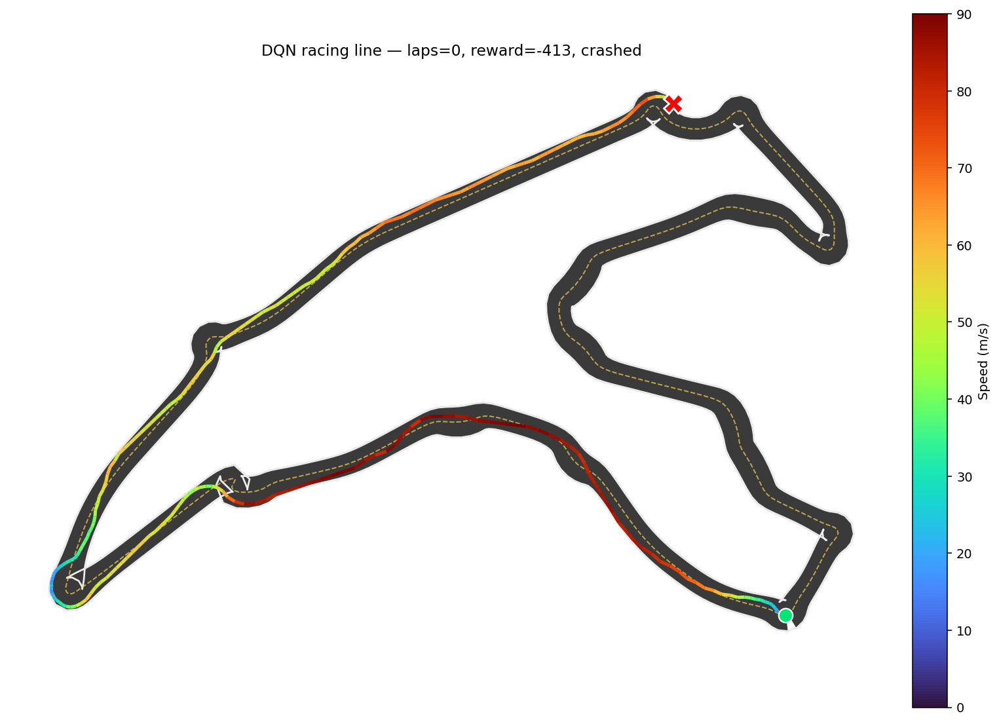
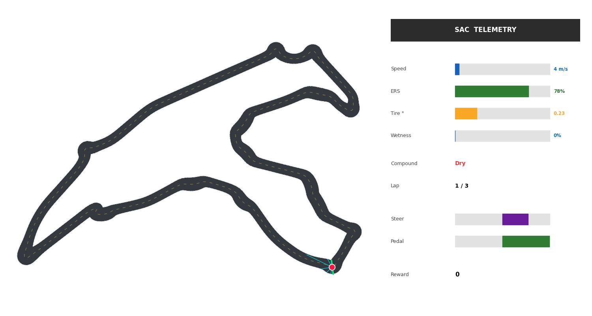
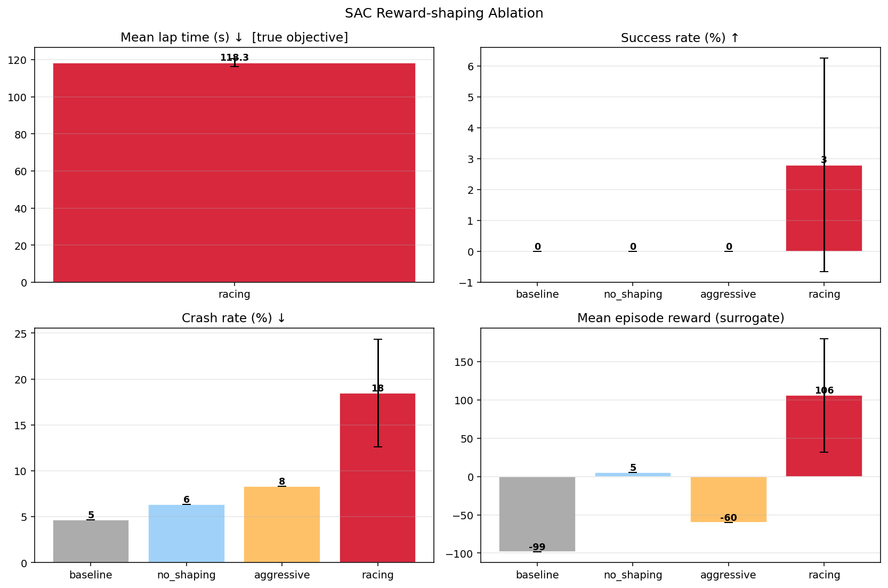
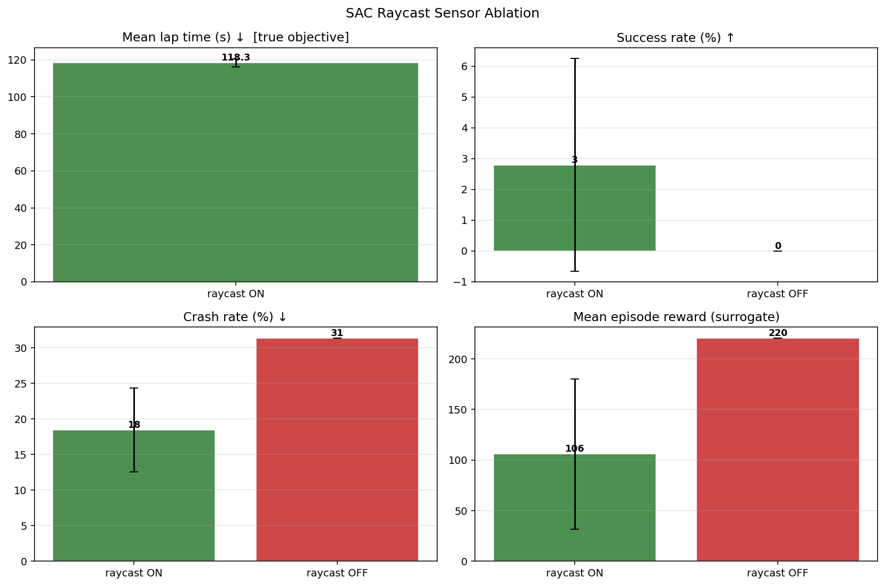
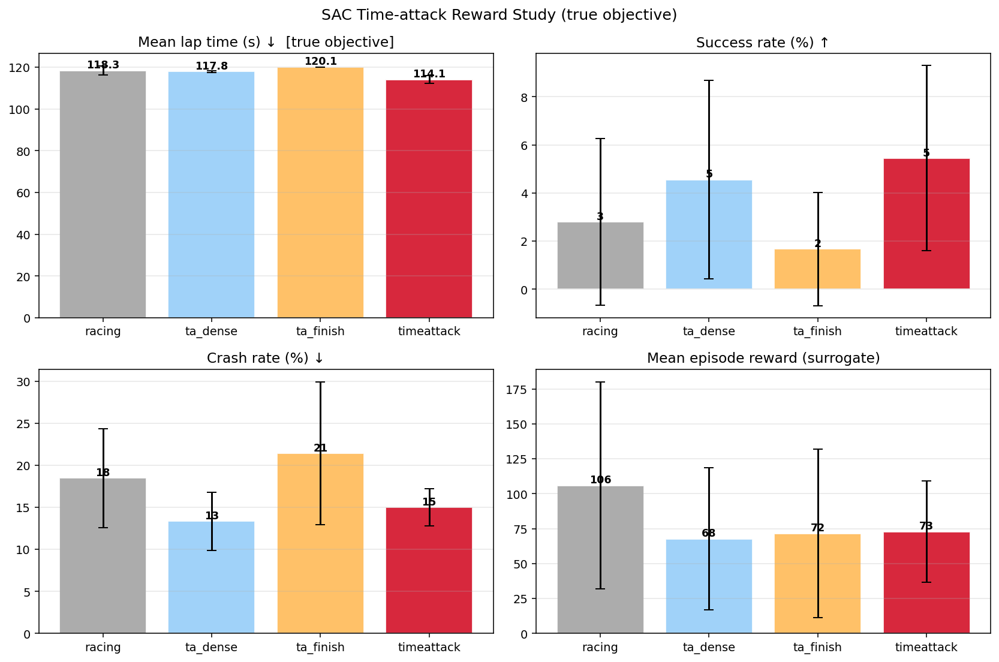
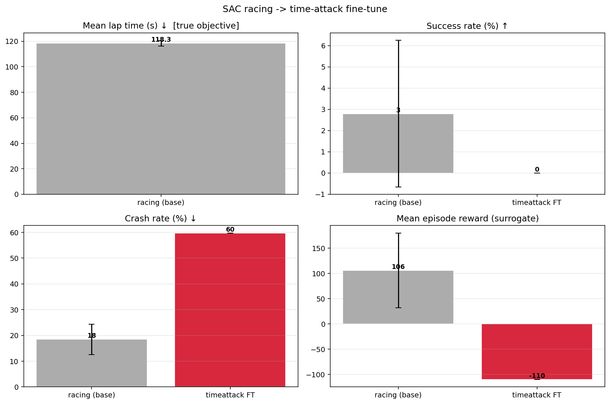

<!--
  ⚠️ 제출 주의: 본 과제(EL5001 Proj 02) 제출 규정상 최종 README·코드·주석·PPT는 **영어**여야 합니다.
  이 한국어 문서는 작업/이해용 초안이며, 제출 직전에 영어판(README.md)으로 옮길 것.
-->

# F1 Driver — Model-free Deep RL (2D 연속 주행)

F1 레이스를 **2차원 연속 주행 MDP**로 모델링하고, **Model-free Deep RL**(DQN · PPO · SAC · TD3)로
"차량 내부 드라이버" 정책을 학습합니다. Project 01의 1차원·이산형 *피트 월 전략가*를,
차량을 직접 조종하는 **2차원·연속형 드라이버**로 전면 재설계했습니다.

> **Proj 01 대비 핵심 변화**
> | | Proj 01 (피트 월 전략가) | **Proj 02 (인-카 드라이버)** |
> |---|---|---|
> | 상태 | 6,840개 **이산** 상태 | **14차원 연속** 벡터(차량·센서·환경) |
> | 행동 | 6개 **이산** 행동 | **연속 `Box(4)`** (조향·페달·ERS·피트) |
> | 해법 | Value Iteration / Q-table | **함수 근사 Deep RL** (DQN·PPO·SAC·TD3) |
> | 트랙 | 19개 섹션 인덱스 | 실제 서킷 이미지에서 추출한 **연속 2D 트랙** |

---

## TL;DR — 한눈에 보는 결과

- **연속 제어(PPO·SAC·TD3)는 운전을 학습**하지만, **행동을 이산화한 DQN은 거의 즉시 충돌(98.9%)하며 붕괴**합니다 → 이 문제에서 액션 이산화는 치명적.
- **SAC = 가장 빠르고(랩타임 118.3 s) 가장 안전(크래시 18.5%)**, **PPO = 가장 자주 완주(성공률 6.9%)** — 두 방법이 상보적.
- **보상 설계가 학습 성패를 가릅니다**: 잘못된 보상에선 정책이 코너 앞에서 멈춰버리는 "brake-and-park" 국소최적에 갇히고, `racing` 보상만 이를 탈출합니다(§9-4).
- raycast 센서를 끄면 **크래시율이 약 2배**로 뛰어, 센서가 안전 주행에 기여함을 확인(§9-5).
- **Phase-2**: 본 과제의 진짜 목표인 "제한시간 내 최단 완주"를 **보상에 직접 인코딩** → `timeattack`(dense+terminal) 보상이 racing 대비 랩타임·성공률·크래시율을 **동시에** 개선하는 최적 reward로 선정(§6-1, §9-7).



*그림. 메인 4개 알고리즘 비교 (5 시드 평균±표준편차). 좌상단이 진짜 목표인 랩타임(↓), 나머지는 성공률(↑)·크래시율(↓)·대리 보상.*

---

## 목차

1. [동기 & 문제 정의](#1-동기--문제-정의)
2. [트랙 재구성 (build_track.py)](#2-트랙-재구성-build_trackpy)
3. [MDP 정식화 (상태·행동·전이·보상)](#3-mdp-정식화-상태행동전이보상)
4. [알고리즘 & 방법론](#4-알고리즘--방법론)
5. [하이퍼파라미터 & 학습 설정](#5-하이퍼파라미터--학습-설정)
6. [리워드 셰이핑 & Ablation](#6-리워드-셰이핑--ablation)
7. [실행 방법](#7-실행-방법)
8. [파일 구조](#8-파일-구조)
9. [결과](#9-결과)
10. [한계 & 향후 과제](#10-한계--향후-과제)
11. [재현성](#11-재현성)

---

## 1. 동기 & 문제 정의

F1 드라이버는 매 순간 **순차적 의사결정**을 합니다 — 코너에서 얼마나 브레이크할지, 직선에서 ERS(배터리 부스트)를
언제 방출할지, 비가 오면 언제 피트인해 타이어를 교체할지. 이 결정들은

- **현재 상태에 의존**(Markovian)하고,
- **지금의 선택이 수십 스텝 뒤 결과(충돌/완주/랩타임)에 영향**을 미치며,
- **장기 누적 보상(안전하고 빠른 완주)** 을 최대화해야 합니다 → 전형적인 **강화학습 문제**.

행동이 **연속(조향·가감속)이면서 이산 전략(피트)이 섞여** 있어, 단순 이산 Q-table로는 표현이 어렵습니다.
따라서 **함수 근사 기반 Deep RL**이 적합합니다.

| | |
|---|---|
| **에이전트** | 차량(드라이버) |
| **목표** | 충돌 없이 목표 랩(기본 3랩)을 **제한시간 안에 최대한 빠르게** 완주 |
| **창의성** | 실제 서킷 이미지에서 추출한 트랙 위에서, **raycast 센서·타이어 온도·연속 날씨(노면 젖음)** 를 포함한 멀티모달 상태로 주행 |

---

## 2. 트랙 재구성 (`build_track.py`)

실제 서킷 이미지(`1/track.webp`)에서 주행 가능한 2D 중앙선을 자동 추출합니다.

```
track.webp ──build_track.py──▶ assets/track.npz         (centerline / left / right / half_width)
                            └─▶ assets/track_preview.png (검증용 4-패널 이미지)
```

**추출 파이프라인**
1. 검은 트랙 밴드 마스킹 → 가장 큰 연결요소만 추출(라벨·범례 제거)
2. 트랙은 고리(annulus) 형태 → **바깥/안쪽 윤곽(contour)의 중점**을 중앙선으로 계산 *(초기 skeleton 그래프-탐색 방식은 무한루프에 빠져 폐기, contour 중점법이 강건)*
3. 윤곽 사이 거리로 **트랙 폭(half_width)** 추정 → 백분위(p10–p80) 클램프 + 스무딩으로 코너 이상치(폭 부풀림) 제거 → 폭 ≈ 47 m
4. 픽셀 → 월드 좌표 변환, 한 랩 길이를 **5,000 m**로 스케일링, **400개 waypoint**로 리샘플

**env는 `track.npz`만 로드**하므로, 이미지를 수정하면 `python build_track.py`만 다시 실행하면 됩니다(코드 수정 불필요).



*그림. 재구성된 2D 트랙. 회색 밴드 = 주행 가능 영역, 흰 선 = 좌/우 경계, 노란 점선 = 중앙선, 초록 점 = start/finish.*

---

## 3. MDP 정식화 (상태·행동·전이·보상)

물리 스텝 간격은 `DT = 0.25 s`, 최고 속도 `MAX_SPEED = 90 m/s`. 타이어·날씨 동역학은 짧은 마이크로
레이스(3랩)에서도 체감되도록 **10배 가속**(`TIRE_SCALE = 10`)했습니다.

### 3-1. 상태 공간 (Observation) — 14차원 연속 벡터

모든 성분을 대략 0–1(또는 −1–1)로 정규화해 신경망 입력으로 사용합니다.

| # | 변수 | 정규화 | 설명 |
|---|------|--------|------|
| 1 | Speed | `v / MAX_SPEED` | 현재 속도 |
| 2–3 | Heading error | `sin`, `cos` | 차량 진행 방향과 트랙 접선의 각도 차(주기성 보존 위해 sin/cos 분리) |
| 4 | Lateral offset | `/ half_width` | 중앙선 기준 횡방향 이탈(부호 = 좌/우) |
| 5 | Compound | 0 / 1 | Dry(0) / Inter(1) 타이어 |
| 6 | Tire temp | 0–1 | Cold → Optimal(0.40–0.75) → Overheat(>0.85) |
| 7 | ERS | 0–1 | 배터리 잔량 |
| 8–12 | Raycast ×5 | 0–1 | 부채꼴(−70°,−35°,0°,35°,70°) 방향 벽까지 거리(`/MAX_RAY=120 m`, 멀면 1) |
| 13 | Wetness | 0–1 | 노면 젖음(연속) |
| 14 | Rain prob | 0–1 | 다음 랩 강우 관련 확률 |

> **왜 이렇게?** ①주행 제어에 필요한 *자기 상태*(속도·방향오차·횡이탈), ②*환경 인식*(raycast 5방향 거리 — 카메라 대신
> 경량 센서), ③*전략 변수*(타이어 컴파운드·온도·ERS·날씨)를 한 벡터에 담아 **멀티모달**로 구성했습니다.
> heading error를 각도 대신 sin/cos로 주는 것은 ±π 경계의 불연속을 없애기 위함입니다.

### 3-2. 행동 공간 (Action) — 혼합형을 단일 `Box(4)`로 인코딩

| # | 행동 | 범위 | 의미 |
|---|------|------|------|
| 0 | Steering | −1 … 1 | 좌 … 우 |
| 1 | Pedal | −1 … 1 | 풀 브레이크 … 풀 스로틀 |
| 2 | ERS_Deploy | −1 … 1 | (내부에서 0…1로 매핑) 배터리 방출량 |
| 3 | Pit_signal | −1 … 1 | `> 0.5`면 피트인 요청 → **다음 start/finish 통과 시** 타이어 교체 |

> **설계 근거 (중요)**: SB3의 연속제어 알고리즘(SAC/DDPG/TD3)은 `Box`만 받고, **어떤 SB3 알고리즘도
> Dict/Tuple 혼합 액션을 지원하지 않습니다.** 그래서 본질적으로 이산인 "피트 결정"을 **연속 Box의 한 차원으로
> 임베딩**(임계값 0.5)해 모든 알고리즘과 호환되게 했습니다. 또 모든 차원을 `[-1, 1]` 대칭으로 둔 것은 SAC의
> tanh 정책과 잘 맞기 때문입니다. (DQN은 이 Box를 21개 이산 액션으로 다시 매핑 — §4)

### 3-3. 전이 (Transition) — 2D 키네마틱 차량 모델

매 스텝 다음 순서로 상태를 갱신합니다. ($g$ = grip, 젖은 노면+Dry 타이어면 0.6, 아니면 1.0)

**① 종방향 (가감속)** — 페달이 가속/제동을, ERS가 추가 부스트를 만들고 드래그로 감속:

$$
a=\begin{cases}\text{pedal}\cdot a_\text{acc}+\text{ers}_\text{dep}\cdot b_\text{ers}\,\mathbb{1}[\text{ers}>0], & \text{pedal}\ge 0\\ \text{pedal}\cdot a_\text{brk}, & \text{pedal}<0\end{cases}
\qquad
v\leftarrow\mathrm{clip}\!\big(v+a\,g\,\Delta t-c_d\,v,\;0,\;v_\text{max}\big)
$$

**② 조향/방향 (속도 비례 권한)**:

$$
\kappa=\min\!\big(1,\;v/v_\text{ref}\big),\qquad
\theta\leftarrow\theta+\text{steer}\cdot\dot\psi_\text{max}\cdot\kappa\cdot g\cdot\Delta t
$$

> ⚠️ **핵심**: 조향 권한 $\kappa$가 **속도에 비례**합니다 → **속도가 0이면 $\kappa=0$, 핸들이 안 돌아갑니다.** 이 한 줄이 뒤에서
> 다룰 "brake-and-park"(코너 앞에서 멈추면 영영 못 빠져나옴) 현상의 물리적 원인입니다(§9-4).

**③ 위치 적분**:

$$\mathbf{p}\leftarrow\mathbf{p}+v\,\Delta t\,(\cos\theta,\;\sin\theta)$$

**④ ERS 배터리** — 스로틀 중 방출 시 소모, 브레이크 시 회생:

$$\text{ers}\leftarrow\text{ers}-\text{ers}_\text{dep}\,r_\text{use}\,\Delta t\,\mathbb{1}[\text{pedal}\ge0]+r_\text{regen}\,\Delta t\,\mathbb{1}[\text{pedal}<0]$$

**⑤ 타이어 온도** — 하드 드라이빙(부하 $\ell$)으로 가열, 주변온도로 냉각:

$$\ell=|\text{pedal}|\,(v/v_\text{max})+0.5\,|\text{steer}|,\qquad
T\leftarrow T+\big(h\,\ell-c\,(T-T_\text{amb})\big)\,\Delta t\,s_\text{tire}$$

**⑥ 노면 젖음** — 현재 날씨 목표값으로 드리프트:

$$w\leftarrow w+(w^{*}-w)\,r_w\,\Delta t\,s_\text{tire},\qquad w^{*}=\mathbb{1}[\text{raining}]$$

> **상수**: $\Delta t{=}0.25$, $v_\text{max}{=}90$, $a_\text{acc}{=}14$, $a_\text{brk}{=}28$, $b_\text{ers}{=}10$, $c_d{=}0.015$, $v_\text{ref}{=}18$, $\dot\psi_\text{max}{=}1.2$, $r_\text{use}{=}0.6$, $r_\text{regen}{=}0.25$, $h{=}0.10$, $c{=}0.06$, $T_\text{amb}{=}0.15$, $r_w{=}0.05$, $s_\text{tire}{=}10$. (타이어·날씨는 $s_\text{tire}{=}10$배 가속)

**⑦ 날씨 전이**  **랩 완료 시** 토글: $P(\text{Dry}\to\text{Rain}){=}0.30$, $P(\text{Rain}\to\text{Dry}){=}0.40$.
**⑧ 피트**  요청이 있으면 다음 랩 진입에서 노면에 맞춰 타이어 교체(젖음>0.45 → Inter, 아니면 Dry), 온도 리셋, 페널티.
**⑨ 진행도**  현재 위치를 중앙선 세그먼트에 **투영**해 미터 단위 연속 progress를 계산(한 스텝에 waypoint 하나 미만을 가도 dense 보상이 매끄럽도록).

초기 상태(reset): start/finish에서 정지(`v=0`), Dry 타이어, ERS 0.8, 맑음. (`--random-weather` 시 40% 확률로 젖은 출발)

### 3-4. 보상 (Reward Shaping)

| 항목 | 값 | 설명 |
|------|----|------|
| Progress (dense) | `+0.05 × 전진거리(m)` | 중앙선 따라 전진한 거리 비례(세그먼트 투영으로 연속) |
| Time penalty | `−0.03 / step` | 빠른 완주 유도 |
| Speed reward | `+speed_reward × (v/Vmax)` | (기본 0, 셰이핑용) 속도 장려 |
| Overheat | `−0.5 / step` | 타이어 과열(>0.85) 구간 |
| Slip | `−0.3 / step` | 젖은 노면 + Dry 타이어 |
| Pit | `−30` | 피트 1회 |
| **Crash** | **`−500` + 종료** | 횡이탈이 트랙 폭 초과(트랙 이탈) |
| **Complete** | **`+200` + 종료** | 목표 랩 완주 |

> (선택) **Terminal time-bonus** `finish_time_bonus`(기본 0, Phase-2 §6-1에서만 사용): 완주 시 빠를수록 추가 보너스
> → 진짜 목표(제한시간 내 최단 완주)를 보상에 **직접** 인코딩.

### 3-5. 종료 조건 (Termination)

- **충돌**: 횡이탈 > 트랙 폭 → `−500`, `terminated`
- **완주**: `laps ≥ n_laps` → `+200`, `terminated`
- **시간 초과**: `steps ≥ max_steps`(기본 `n_laps×500` = 3랩이면 **1500 스텝 = 375 s**) → `truncated`

### 3-6. Markov 성립(근사)

차량 운동·타이어·날씨·센서 정보가 모두 상태에 포함되어 다음 전이를 (확률적으로) 결정합니다. 날씨의 잠재
상태(raining 여부)는 명시 관측되지 않지만 wetness 추세로 추정 가능 → **근사적으로 Markovian**(PDF가 허용하는 범위).

---

## 4. 알고리즘 & 방법론

PDF 요구(① value-based ② policy-based ③ your solution)에 맞춘 라인업 + 비교군 TD3:

| 역할 | 알고리즘 | 액션 공간 | 한 줄 근거 |
|------|----------|-----------|-----------|
| **Baseline 1 (value-based)** | **DQN** | Discrete(21) | Q-러닝의 함수근사판. 연속 Box를 이산화해야만 동작 → 이산화의 한계를 보여주는 대조군 |
| **Baseline 2 (policy-based)** | **PPO** | Box(4) | on-policy actor-critic, 안정적이고 표준적인 정책경사 기준선 |
| **Your solution** | **SAC** | Box(4) | off-policy + 엔트로피 최대화 — 연속 제어·확률적 동역학에 가장 적합 |
| **추가 비교군** | **TD3** | Box(4) | off-policy **결정론적** 정책 — SAC의 "엔트로피 탐색" 효과를 분리해 보기 위한 대조 |

**DiscretizedF1Driver** (`wrappers.py`): 조향 5단계 × {브레이크/코스트/스로틀} + {스로틀+ERS} 5개 + 피트 1개
= **21개 이산 액션**. DQN이 같은 환경에서 baseline으로 돌도록 연속 Box를 이산 격자로 매핑합니다.

**왜 SAC를 your solution으로?**
- **off-policy → 높은 샘플 효율**: 리플레이 버퍼 재사용으로 짧은 마이크로 레이스에서도 데이터를 알뜰하게 씀.
- **엔트로피 최대화 탐색**: 정책에 엔트로피 보너스를 더해 다양한 행동을 유지 → 젖음/타이어 같은 **확률적 동역학**과
  좁은 코너 통과에서 더 강건(결정론적 TD3가 빠지기 쉬운 나쁜 국소최적을 회피).
- **연속 제어를 native로** 처리(이산화 손실 없음), tanh-squashed 가우시안 정책으로 `[-1,1]` 액션과 정합.

> **방법론 요약**: "이산화 가치기반(DQN) → 표준 정책경사(PPO) → 엔트로피 기반 off-policy(SAC) → 결정론적 off-policy(TD3)"
> 의 4점 비교로, *액션 표현(이산 vs 연속)* 과 *탐색 방식(엔트로피 vs 결정론)* 이 성능에 미치는 영향을 한 번에 분리합니다.

---

## 5. 하이퍼파라미터 & 학습 설정

공통: `γ = 0.99`, MLP 정책 `[256, 256]`(PPO/SAC/TD3), device 자동 감지(GPU 우선).

| 알고리즘 | 주요 하이퍼파라미터 |
|----------|--------------------|
| **DQN** | lr 1e-3, buffer 200k, learning_starts 5k, batch 128, train_freq 4, target_update 2k, exploration_fraction 0.3, final_eps 0.05 |
| **PPO** | n_steps 1024, batch 256, n_epochs 10, GAE λ 0.95, ent_coef 0.0, lr 3e-4, **n_envs 병렬**(SubprocVecEnv) |
| **SAC** | lr 3e-4, buffer 300k, learning_starts 10k, batch 256, τ 0.005, train_freq 1, ent_coef **auto** |
| **TD3** | SAC와 동일 골격 + action_noise N(0, 0.1), 결정론적 타깃 정책 |

**선택 근거 (한 줄)**
- **공통**: `γ 0.99` — 완주는 수백 스텝 뒤의 보상이라 먼 미래를 충분히 반영해야 함. `net [256,256]` — 14차원 멀티모달 입력을 처리할 적당한 용량(과적합 없이).
- **DQN**: `lr 1e-3` 이산 Q에 표준값, `exploration_fraction 0.3` 21개 이산 액션을 초반 30% 구간 충분히 탐색, `buffer 200k` 에피소드가 짧아 빠르게 차므로 작아도 충분.
- **PPO**: `n_steps 1024 × n_envs 6 ≈ 6k` 큰 on-policy 롤아웃으로 정책경사 분산↓, `ent_coef 0` 연속 제어엔 과한 엔트로피 보너스 불필요, `GAE λ 0.95` 편향-분산 절충 표준값.
- **SAC**: `lr 3e-4·batch 256·τ 0.005` SAC 논문 기본값, `learning_starts 10k` 초기 랜덤 워밍업으로 버퍼 다양화 후 학습, `ent_coef auto` 엔트로피 온도를 자동 조절해 탐색량 수동 튜닝 부담 제거, `train_freq 1` off-policy 샘플효율 극대화.
- **TD3**: SAC와 동일 골격에 `action_noise N(0,0.1)` — 결정론적 정책이라 탐색 노이즈를 외부에서 주입(엔트로피 자동탐색과의 대조군).

- **병렬 env**: 병목은 GPU가 아니라 **Python 환경 스텝**이라, PPO는 `--n-envs`로 SubprocVecEnv 병렬화하면 GPU보다
  속도 이득이 큽니다. (측정 throughput: PPO ~930 fps(6 envs), SAC ~92 fps)
- **로깅**: `EvalCallback`(주기 평가), `CheckpointCallback`(체크포인트), `EpisodeMetrics`(에피소드별
  성공/크래시/랩길이/평균속도/과열비율 → CSV — 모든 figure를 이 CSV로 재생성), tensorboard.

---

## 6. 리워드 셰이핑 & Ablation

보상 가중치는 모두 `F1DriverEnv(...)` 생성자 kwargs로 조정 가능합니다(기본값=설계값이라 비파괴).
`train.py --reward-preset`으로 변형 학습:

| Preset | 설정 | 검증 목적 |
|--------|------|----------|
| `baseline` | 설계 그대로 | 기준 |
| `no_shaping` | overheat/slip/time 페널티 제거 | **보상 셰이핑이 실제로 도움이 되는가** |
| `aggressive` | crash_pen 200 + speed_reward 0.02 | **충돌 회피 과다("소심한 정책")** 완화 효과 |
| `racing` | crash_pen 100 + speed_reward 0.05 | brake-and-park 국소최적 탈출 (**메인 학습에 사용한 프리셋**) |

→ 이 변형들이 **your solution(SAC)의 ablation study**를 구성합니다(결과 §9-4). raycast on/off(`--no-raycast`) ablation은 §9-5.

### 6-1. Phase-2: 타임어택 reward 설계 (진짜 목표 직접 최적화) — *진행 중*

본 과제의 *진짜* 목표는 **제한시간(3랩 = 375 s) 안에 가능한 빠르게 완주**하는 것입니다. Phase-1 결과를 분석하니
**시간제한이 binding**임을 발견했습니다 — 완주한 에피소드의 랩타임(SAC 118.3 s, PPO 121.3 s)이 제한선(125 s/랩)에
거의 붙어 있습니다. 즉 **"빠르게"와 "완주"가 충돌하지 않고 같은 방향**입니다(너무 느린 정책은 충돌이 아니라
**시간초과로 실패**). 페이스를 끌어올리면 성공률↑·랩타임↓이 동시에 좋아지고, 유일한 한계는 충돌입니다.

그런데 기존 완주 보너스는 **고정 +200**이라 *얼마나 빨리* 끝냈는지를 전혀 반영하지 못합니다. 이를 보완하려고
**terminal time-bonus**를 추가했습니다(env kwarg `finish_time_bonus`, 기본 0 → 비파괴):

```
완주 시  reward += complete_bonus + finish_time_bonus × max(1 − steps/max_steps, 0)
```

완주가 빠를수록(steps 작을수록) 보너스가 커집니다. 한계효과는 `−finish_time_bonus/max_steps`(예: 300/1500 = **0.2/step**)로
dense `time_pen`(0.03)보다 훨씬 강하지만, **완주해야만 받는 terminal 신호**라서 정지(park) 정책은 영향받지 않고
**완주에 성공한 정책만 더 빨리 가도록** 유도합니다.

레버를 하나씩 분리하는 3개 프리셋(비교 baseline = `racing`):

| Preset | 설정 (vs `racing`) | 격리하는 레버 |
|--------|--------------------|----------------|
| `timeattack_dense` | speed_reward 0.10 + time_pen 0.06 | dense 페이스 압력 강화 |
| `timeattack_finish` | + finish_time_bonus 300 | terminal 빠른-완주 보너스 |
| `timeattack` | dense + terminal 둘 다 | 풀 제안 |

**진행 스토리**: `bash run_phase2.sh`로 (a) SAC 3프리셋 × 3시드 **from-scratch sweep** → 어느 보상이 최단 랩타임을
내는지 비교, (b) 최고 `racing` 모델에서 저LR **warm-start fine-tune** → "이미 운전을 배운 정책을 더 빠르게 밀어붙일 수
있는가" 확인. **평가는 불변 지표(랩타임/성공률/크래시율)로만** — 프리셋마다 보상 스케일이 달라 보상끼리 비교 불가.
결과는 §9-7.

### 6-2. Phase-3: 부드럽고 빠른 코너링 (커리큘럼 + 부드러움)

Phase-2 최적(`timeattack`)도 성공률이 낮은 핵심 원인은 **코너**입니다(§9-7). 두 개의 직교 레버로 이를 공략합니다:

- **① 랜덤 시작 커리큘럼**(env `random_start`): 지금까지 모든 에피소드가 idx=0에서 출발해 **1번 코너만 수천 번**
  연습하고 뒤쪽 코너는 거기까지 살아남아야만 봤습니다. 학습 시 reset 위치를 트랙 전 구간에 균등 랜덤 배치해
  **모든 코너를 균등 연습**합니다. **평가·보고 지표는 idx=0 고정**(Phase-1/2와 동일 비교축).
- **② 부드러움 페널티 λ**(env `steer_pen`): 스텝당 `−λ·|Δsteer|`로 덜컥대는 조향을 억제합니다. λ가 너무 크면
  다시 timid(brake-and-park §9-4)해지므로 **명확한 sweet spot**이 존재 → λ ∈ {0, 0.02, 0.05, 0.1} **sweep**으로
  "**랩타임·성공률을 노이즈 내로 유지하며 jerk(=평균 `|Δsteer|`)를 최소화하는 λ**"를 선정.

**측정 방법**: 학습은 랜덤 시작이라 학습 롤아웃 지표는 idx=0과 비교 불가. 따라서 학습 후 **idx=0에서 별도 평가**
(`{tag}_eval0.csv`, 확률적 정책 300ep — 학습 롤아웃과 같은 분포)를 떠서 그걸로만 §9-9를 보고합니다.
λ=0 sweep 점은 **커리큘럼 단독** 효과(랜덤 시작 vs Phase-2 idx=0)를 격리합니다. 결과는 §9-9.

---

## 7. 실행 방법

```bash
# 0) 의존성
pip install -r requirements.txt

# 1) 트랙 추출 (이미지 수정 시에만 재실행)
python build_track.py

# 2) 파이프라인 점검 (CPU에서 빠르게)
python train.py --algo all --smoke

# 3) 메인 학습 (GPU 서버 권장)
python train.py --algo dqn --reward-preset racing --timesteps 500000  --seed 0
python train.py --algo ppo --reward-preset racing --timesteps 1000000 --n-envs 6 --seed 0
python train.py --algo sac --reward-preset racing --timesteps 500000  --seed 0
python train.py --algo td3 --reward-preset racing --timesteps 500000  --seed 0
#  Ablation:
python train.py --algo sac --reward-preset no_shaping --seed 0
python train.py --algo sac --reward-preset racing --no-raycast --seed 0

# 3b) Phase-2 타임어택 reward 설계 (§6-1)
python train.py --algo sac --reward-preset timeattack --seed 0
#  best 모델에서 저LR warm-start fine-tune:
python train.py --algo sac --reward-preset timeattack --seed 0 \
    --init-from results/sac_racing_seed0_best/best_model.zip --learning-rate 1e-4 --timesteps 200000

# 3c) Phase-3 커리큘럼 + 부드러움 (§6-2) — 학습은 랜덤 시작, 평가는 idx=0
python train.py --algo sac --reward-preset timeattack --steer-pen 0.05 --random-start --seed 0
#  기존 best 모델을 재학습 없이 idx=0로 평가만 (Phase-2 베이스라인):
python train.py --algo sac --reward-preset timeattack --eval-only \
    --init-from results/sac_timeattack_seed0_best/best_model.zip --seed 0

# 4) 시각화 (results/의 모델·로그를 자동 탐색)
python visualize.py
```

서버에서 한 번에: **메인+ablation은 `bash run_all.sh`**, **Phase-2는 `bash run_phase2.sh`**,
**Phase-3는 `bash run_phase3.sh`**(각각 앞 단계 이후 실행).

**출력물**(`results/`): `<tag>.zip`(모델), `<tag>_best/`(best), `<tag>_metrics.csv`, `eval/evaluations.npz`,
`tb/`(tensorboard), `viz/*.png|gif`. 태그 = `<algo>[_<preset>][_noray][_wx][_ft]_seed<n>`.

---

## 8. 파일 구조

```
2/f1/
├── build_track.py    # 트랙 이미지 → 2D 중앙선/경계 추출 (assets/track.npz)
├── env.py            # F1DriverEnv (gymnasium 연속 환경: 상태·행동·전이·보상)
├── wrappers.py       # DiscretizedF1Driver (DQN용 21개 이산 액션)
├── train.py          # SB3 학습 파이프라인 (DQN/PPO/SAC/TD3, 프리셋·fine-tune·eval·ckpt·metrics·tb)
├── visualize.py      # 트랙맵·레이싱라인·raycast GIF·학습곡선·알고리즘 비교·ablation
├── run_all.sh        # 메인 매트릭스(4 algo×5 seed) + 보상/raycast ablation + viz (GPU 서버)
├── run_phase2.sh     # Phase-2 타임어택 reward sweep + warm-start fine-tune + viz
├── run_phase3.sh     # Phase-3 랜덤 시작 커리큘럼 + 부드러움 λ sweep + idx=0 eval + viz
├── requirements.txt
├── assets/           # track.npz, track.webp, track_preview.png
└── results/          # 학습 결과물 (CSV·figure·best 모델 일부만 커밋, 나머지 .gitignore)
```

---

## 9. 결과

GPU 서버에서 **메인 4개 알고리즘 × 5 시드**(`racing` 프리셋, 날씨 토글은 랩 경계에서 자연 발생) +
**SAC ablation**(보상 프리셋 / raycast on·off)을 학습했습니다. 학습량: DQN·SAC·TD3 각 500k, PPO 1M timestep.
모든 수치는 **마지막 300 에피소드 평균(± 시드 표준편차)** 입니다.

> **평가 지표 주의**: 보상은 **대리(surrogate) 지표**일 뿐, 진짜 목표는 **충돌 없이 빠르게 완주**하는 것입니다.
> 핵심 지표는 **랩타임(초, 성공 에피소드에 한해 `ep_len·DT/N_LAPS`)·성공률·크래시율**이며, 보상은 보조로만 봅니다.
> 또 **보상 프리셋이 다르면 스케일이 달라 보상끼리 비교 불가** — ablation은 랩타임·성공률·진행거리로 판단합니다.

### 9-1. 학습 곡선



x축을 **timestep**으로 둬(에피소드 인덱스가 아님), 즉시 충돌해 짧은 에피소드를 수천 개 만드는 DQN과
긴 에피소드의 연속제어 알고리즘을 공정하게 비교합니다.

- **SAC**: 샘플 효율 최고 — ~350k에서 보상 ~165로 가장 빠르게 수렴.
- **PPO**: 더 느리게 오르지만 1M까지 꾸준히 상승해 최종 ~145로 SAC와 동급.
- **TD3**: 초반 −210까지 떨어졌다 회복(~−45)하나 끝내 양(+)으로 못 올라옴(결정론적 탐색의 불안정).
- **DQN**: ~−90에서 평탄 — 이산화 액션으론 주행 자체를 학습 못함.

### 9-2. 알고리즘 비교

| 방법 | 랩타임(s) ↓ | 성공률 ↑ | 크래시율 ↓ | 평균 진행거리(m) | 평균 보상(대리) |
|------|------------:|---------:|-----------:|-----------------:|----------------:|
| DQN  | — (완주 없음) | 0.0 % | 98.9 % |   767 |  −86 |
| **PPO** | 121.3 | **6.9 %** | 30.8 % | **5099** | **142** |
| **SAC** | **118.3** | 2.8 % | **18.5 %** | 4834 | 106 |
| TD3  | 120.5 | 1.2 % | 18.9 % | 2520 |  −86 |

- **이산화 value-based(DQN)의 붕괴**: 21개 이산 액션으로는 거의 즉시(평균 767 m) 충돌(98.9 %)하며 완주 0건.
  연속 제어 문제를 이산화로 푸는 접근의 한계를 명확히 보여줍니다.
- **PPO vs SAC (핵심 트레이드오프)**: PPO가 **완주를 가장 자주(6.9 %)** 하고 가장 멀리 가지만, SAC는
  **랩타임이 가장 짧고(118.3 s) 가장 안전(18.5 %)** → "자주 끝내는 PPO" vs "빠르고 안전한 SAC".
- 성공률이 전반적으로 낮은(≤ 7 %) 이유: 3랩 내내 코너·과열·날씨/피트 이벤트를 모두 통과해야 하는 난도 높은
  마이크로 레이스이기 때문(결정론적 롤아웃은 더 멀리 감 — §9-3).

### 9-3. 레이싱 라인 / 주행 영상

| SAC (your solution) | DQN (이산화 baseline) |
|---|---|
|  |  |

*속도 색상 궤적(파랑=느림, 빨강=빠름). 결정론적 롤아웃(seed 7) 기준 **SAC는 직선 가속→코너 감속으로 2랩 이상 주행**(reward ~454),
DQN은 출발 직후 충돌(빨간 X)로 종료. PPO·TD3 궤적은 `results/viz/traj_ppo.png`, `traj_td3.png`.*



*SAC 주행 애니메이션 — 차량(빨강), 5방향 raycast(하늘색), 우측 텔레메트리(속도·ERS·타이어온도·젖음·컴파운드·랩·조향·페달).*

### 9-4. 보상 셰이핑 Ablation (SAC)



| 프리셋 | 성공률 | 크래시율 | 진행거리(m) | 거동 |
|--------|-------:|---------:|------------:|------|
| baseline   | 0 % | 4.7 % |  648 | 코너 앞에서 정지 후 주차("brake-and-park") |
| no_shaping | 0 % | 6.3 % |  747 | 동일하게 주차 |
| aggressive | 0 % | 8.3 % |  775 | 거의 주차(방향만 약간 개선) |
| **racing** | **2.8 %** | 18.5 % | **4834** | **유일하게 실제 주행** |

→ **핵심 발견**: 충돌 페널티(−500)가 시간 페널티를 압도하면, 약한 정책은 코너에서 **완전 정지**하는 안전한
국소최적("brake-and-park")에 갇힙니다 — 게다가 **속도 0이면 조향 권한도 0**(§3-3 ②)이라 영영 못 빠져나옵니다.
속도 보상을 강하게 준 `racing`(crash_pen 100 + speed_reward 0.05)만 이 국소최적을 탈출해 진행거리가 7× 이상 증가합니다.
즉 **보상 셰이핑은 미세조정이 아니라 학습 성패를 가르는 요소**입니다(크래시율 상승은 정지 대신 실제로 코너에
진입하기 때문 — 의도된 trade-off).

### 9-5. Raycast 센서 Ablation (SAC)



| 설정 | 크래시율 | 진행거리(m) | 평균 보상 |
|------|---------:|------------:|----------:|
| raycast **ON**  (seed 0) | 14.0 % | 2901 |  32 |
| raycast **OFF** (seed 0) | 31.3 % | 7653 | 220 |

→ 센서를 끄면 진행거리·보상은 오히려 커지지만 **크래시율이 약 2배**로 뜁니다. raycast는 벽 거리 정보를 줘서
**충돌을 회피(안전성↑)** 하는 대신 다소 보수적으로 만듭니다 — 센서가 안전 주행에 기여함을 확인.
(메인 비교의 raycast-ON SAC는 5 시드 평균 크래시 18.5 %; OFF는 단일 시드라 절대수치보다 **경향**으로 해석)

### 9-6. 진행 중 — Phase-2 타임어택 reward 설계 (스토리)

> `bash run_phase2.sh` 완료 후 §9-7 표를 채웁니다. 아래는 **가설과 진행 방향**.

**가설**: (§6-1) 시간제한이 binding이므로, 속도를 더 미는 보상(`timeattack_*`)은 랩타임을 줄이면서 **동시에**
성공률도 올릴 수 있다. 특히 terminal time-bonus(`timeattack_finish`)는 "완주에 성공한 정책만" 가속하므로,
brake-and-park 위험 없이 안전하게 페이스를 끌어올릴 것으로 기대.

**진행**: ① 3개 프리셋(dense / finish / both)을 from-scratch로 비교해 **어느 레버가 효과적인지** 분리 →
② 최고 `racing` 정책을 그 보상으로 warm-start fine-tune해 **랩타임 추가 단축 + 안전(크래시) trade-off**를 측정.
"진짜 목표를 지표(랩타임)에 맞춰 보상까지 설계했다"는 닫힌 루프가 이 프로젝트의 마무리입니다.

### 9-7. Phase-2 결과 — 최적 reward 선정



SAC 3프리셋 × 3시드 from-scratch sweep. 모든 수치는 §9 전체와 동일하게 **마지막 300 에피소드 평균**,
랩타임은 **성공 에피소드에 한해** `ep_len·DT/N_LAPS`(보상 스케일이 다르므로 불변 지표로만 비교).

| 프리셋 | 랩타임(s) ↓ | 성공률 ↑ | 크래시율 ↓ | 비고 |
|--------|------------:|---------:|-----------:|------|
| racing (base) | 118.3 | 2.8 % | 18.5 % | Phase-1 기준 (5 seed) |
| timeattack_dense | 117.8 | 4.6 % | **13.3 %** | dense 페이스만 — 가장 안전 |
| timeattack_finish | 120.1 ※ | 1.7 % | 21.4 % | terminal만 — 효과 없음(오히려 악화) |
| **timeattack** | **114.1** | **5.4 %** | 15.0 % | **둘 다 — 최적(3지표 모두 base 대비 개선)** |
| timeattack (fine-tune) | — 완주 0 | 0.0 % | 59.7 % † | warm-start 붕괴 |

<sub>※ `timeattack_finish`는 3시드 중 1시드만 완주에 성공 → 랩타임은 단일 시드 추정치.
† fine-tune 3시드의 metrics CSV가 **바이트 단위로 동일**(`run_phase2.sh`/metrics 태그의 시드 미반영 로깅 버그) →
best 모델은 시드별로 다르나 학습 곡선은 단일 트레이스로만 신뢰. 절대수치보다 **붕괴 경향**으로만 해석.</sub>

**선정: `timeattack`(dense + terminal 둘 다)가 최적.** racing 대비 **랩타임 −4.2 s(118.3→114.1)**,
**성공률 ≈2배(2.8→5.4 %)**, **크래시율 −3.5 pp(18.5→15.0 %)**로 세 지표를 **동시에** 개선(Pareto) — §6-1 가설대로
시간제한이 binding이라 페이스를 미는 보상이 "더 빠르게 + 더 자주 완주"를 함께 달성합니다.

**레버 분리 해석**:
- **dense가 핵심 레버**: `timeattack_dense`만으로도 더 안전(13.3 %)하고 완주가 늘어(4.6 %) brake-and-park 쪽으로
  되돌아가지 않음 — speed_reward↑/time_pen↑이 코너에서도 페이스를 유지하게 함.
- **terminal 단독(`finish`)은 효과 없음**: 완주해야만 받는 신호라 **아직 거의 완주를 못 하는 단계**에선 보상이
  너무 sparse해 학습을 못 끌어줌(오히려 base보다 악화). 단, **dense로 완주 빈도를 먼저 올린 뒤** terminal을
  더하면(`timeattack`) 그 위에서 추가로 가속 → 두 레버는 **상보적**.



**fine-tune은 실패**: 최고 `racing` 정책에서 저LR warm-start로 `timeattack` 보상을 입혔더니 진행거리 ~600 m,
크래시 59.7 %로 **붕괴**(완주 0). 이미 수렴한 정책에 더 공격적인 보상을 얹는 것이 오히려 학습된 안전 거동을
무너뜨린 것으로 보입니다 — **from-scratch sweep이 fine-tune보다 안정적**이라는 (다소 의외의) 결론.
다만 위 † 로깅 이슈로 3시드 robustness는 미확정이라, **단정보다 경향**으로 보고합니다.

### 9-8. 요약

- **연속 제어(PPO/SAC/TD3) ≫ 이산화 value-based(DQN)** — 이 문제에서 액션 이산화는 치명적.
- **SAC = 가장 빠르고 안전**(your solution으로서 타당), **PPO = 가장 자주 완주** — 둘이 상보적.
- 보상 셰이핑(§9-4)이 brake-and-park 탈출에 결정적, raycast 센서(§9-5)는 안전성에 기여.
- Phase-2(§9-6/7): 진짜 목표(제한시간 내 최단 완주)를 보상에 직접 인코딩 → **`timeattack`(dense+terminal)이 최적** — racing 대비 랩타임 −4.2 s·성공률 ≈2배·크래시율 −3.5 pp(Pareto 개선). dense가 핵심 레버, terminal 단독은 sparse해 무효, warm-start fine-tune은 붕괴.
- Phase-3(§6-2/9-9, 진행 중): 코너 약점을 **랜덤 시작 커리큘럼 + 부드러움 페널티 λ**로 공략 — idx=0 평가로 비교.

### 9-9. Phase-3 결과 — 커리큘럼 + 부드러움 (학습 후 업데이트)

> 🚧 `bash run_phase3.sh` 완료 후 figure(`results/viz/phase3_curriculum_smooth.png`)와 아래 표를 채웁니다.
> 모든 행은 **idx=0 평가**(`{tag}_eval0.csv`, §6-2)라 Phase-1/2와 같은 축. jerk = 스텝당 평균 `|Δsteer|`.

| 설정 | 랩타임(s) ↓ | 성공률 ↑ | 크래시율 ↓ | jerk ↓ | 비고 |
|------|------------:|---------:|-----------:|-------:|------|
| timeattack (idx=0) | 114.1 | 5.4 % | 15.0 % | TBD | Phase-2 최적(eval-only) |
| + 커리큘럼 (λ=0) | TBD | TBD | TBD | TBD | 랜덤 시작만 격리 |
| + λ=0.02 | TBD | TBD | TBD | TBD | |
| + λ=0.05 | TBD | TBD | TBD | TBD | |
| + λ=0.1 | TBD | TBD | TBD | TBD | |

*(빈칸은 학습 후 채움 — ① 랜덤 시작 커리큘럼이 코너 연습으로 성공률/크래시를 개선하는지, ② 랩타임·성공률을
노이즈 내로 유지하며 jerk를 낮추는 최적 λ는 무엇인지 보고)*

---

## 10. 한계 & 향후 과제

- **단일 트랙**: 한 서킷에만 학습 → 일반화 미검증. *향후*: 절차적 생성 트랙으로 멀티-트랙 일반화.
- **낮은 절대 성공률(≤ 7 %)**: 마이크로 레이스 난도가 높음. Phase-2 reward 설계와 커리큘럼(쉬운 트랙→어려운 트랙)으로 개선 여지.
- **TD3 불안정**: 결정론적 정책이 좁은 코너에서 나쁜 국소최적에 빠짐 → 노이즈 스케줄/하이퍼파라미터 재탐색 필요.
- **날씨 강제(`--random-weather`) 시 재붕괴**: 젖은 출발이 timid collapse를 유발 → 현재는 랩 경계 자연발생만 사용. 날씨 커리큘럼이 향후 과제.
- **물리 모델의 단순화**: bicycle 키네마틱 근사(타이어 슬립앵글·하중이동 등 미반영) — 교육용으로는 충분하나 사실성엔 한계.

---

## 11. 재현성

- **시드**: 메인 비교는 시드 0–4(5개), ablation·Phase-2는 0–2(3개). 모든 결과는 시드 평균±표준편차로 보고.
- **결정성**: `EpisodeMetrics` CSV에 에피소드별 지표를 저장 → 모든 figure를 `python visualize.py`로 재생성 가능.
- **환경 버전**: `requirements.txt` 참고 (gymnasium 1.2.3, stable-baselines3 2.8.0, torch 2.12.0, scipy, scikit-image).
- **하드웨어**: 학습은 6-core + 0.20-GPU 서버(메인 매트릭스 ~10–18 h, Phase-2 ~15–17 h), 로컬은 CPU로 smoke 점검.
- **병목**: GPU가 아니라 Python 환경 스텝 → PPO는 SubprocVecEnv 병렬화로 가속.
